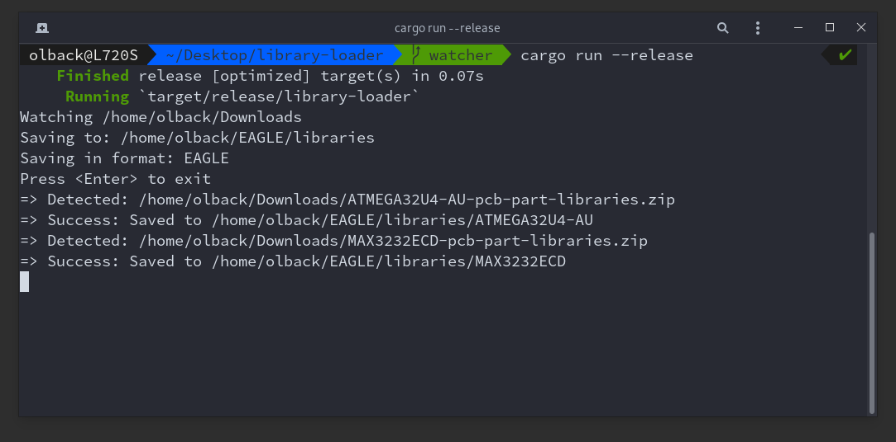

# Library Loader :books:



Status: [](https://circleci.com/gh/olback/library-loader/tree/master)

<!---
OS | Status
-- | ------
Linux | [](https://circleci.com/gh/olback/library-loader/tree/master)
Windows | WIP
Mac | WIP
--->

## Getting started

1. Create an account on [componentsearchengine.com](https://componentsearchengine.com/) if you don't have one already.
2. Download a prebuilt version of library-loader from the [releases page](https://github.com/olback/library-loader/releases).

### Extra steps for Library Loader CLI
3. Generate a config file to store your settings in.  
Option 1: Generate a global config `library-loader -gh`  
Option 2: Generate a local config `library-loader -g` (current working directory).
4. Edit the config file to your liking. Global config locations:  
Windows: `C:\Users\%user%\AppData\Roaming\LibraryLoader.toml`  
Linux: `/home/$USER/.config/LibraryLoader.toml`  
Mac: `$HOME/Library/Preferences/LibraryLoader.toml`

### Build from source
1. Make sure you have the rust toolchain installed.
2. Download the source. `git clone https://github.com/olback/library-loader.git`.
3. `cd` into `library-loader/ll-[cli/gui]`.
4. `cargo build --release --bin library-loader-[cli/bin]`

### Building fromo source using Docker/docker-compose ###
```bash
git clone https://github.com/olback/library-loader.git
cd library-loader
docker-compose build
docker-compose run --rm rust sh -c "(cd ll-gui && cargo build --release --bin library-loader-gui) && (cd ll-cli && cargo build --release --bin library-loader-cli)"
```
This will first build a container image containing the rust toolchain and dependencies, followed by the gui and cli applications inside a container based on that image.

#### Extra steps for Library Loader GUI
5. `sudo ./install.sh`

## What/Why?
This is an implementation of [https://www.samacsys.com/library-loader/](https://www.samacsys.com/library-loader/) in Rust. Why? Well, since the library-loader SamacSys provides only works on Windows, I thought it would be neat to make something similar but available to everyone.

For upcomming features, please see the [TODO.md](TODO.md).

## License
[GNU Affero General Public License v3.0](LICENSE)
